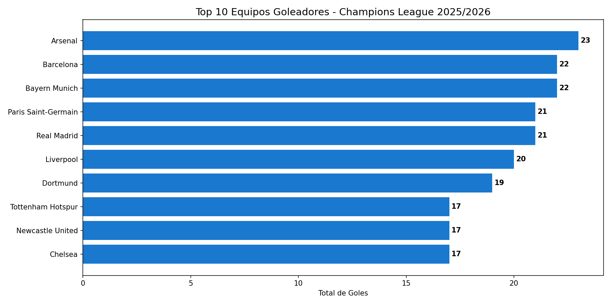
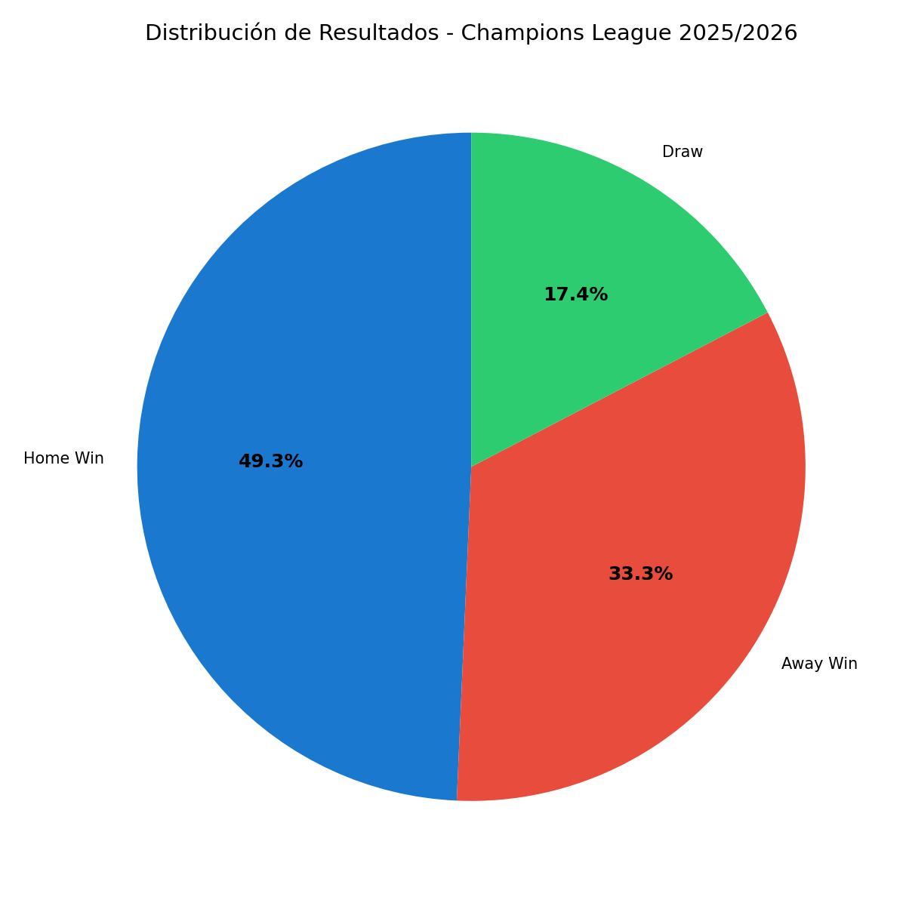
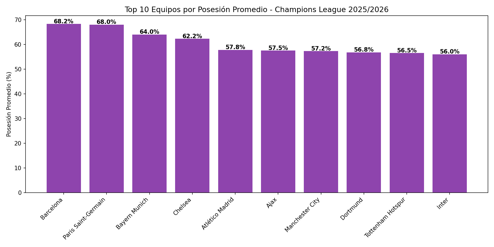
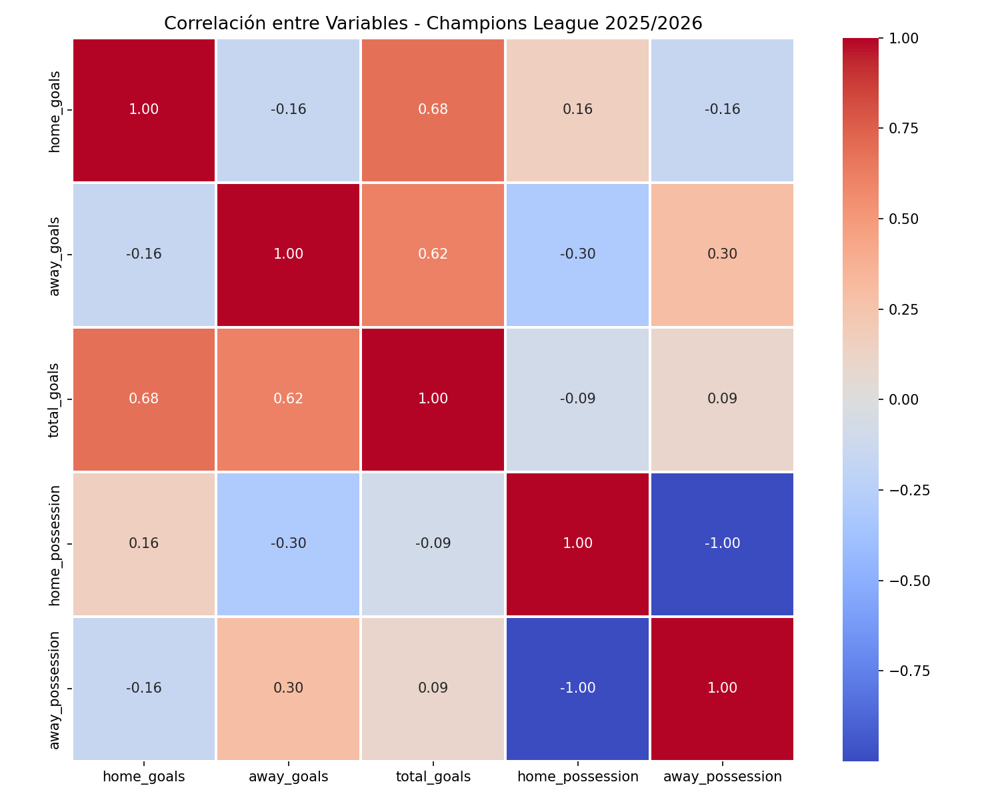

# ⚽ Análisis Champions League 2025/2026 🏆

## 📋 Descripción
Análisis completo de 144 partidos y 487 goles de la Champions League 2025/2026 utilizando SQL, Python, Excel y Power BI.

## 🛠️ Herramientas utilizadas
- **SQL (SQLite)** — Extracción y consultas de datos
- **Python** — Limpieza y visualización (pandas, matplotlib, seaborn)
- **Excel** — Tablas y gráficos dinámicos
- **Power BI** — Dashboard interactivo con KPIs

## 📊 Hallazgos principales
- Arsenal lidera con 23 goles como local
- Barcelona domina la posesión con 68.2%
- El equipo local gana el 49.3% de los partidos
- Promedio de 3.38 goles por partido
- Partido más goleador: Leverkusen vs PSG (9 goles)

## 📸 Visualizaciones

## 📁 Archivos del proyecto
| Archivo | Descripción |
|---|---|
| `champions_league_matches.csv` | Dataset original |
| `champions_league_2025.db` | Base de datos SQLite |
| `Champions_League_2025_2026.ipynb` | Análisis en Python |
| `champions_league_limpio.xlsx` | Excel con tablas dinámicas |
| `Champions_League_2025_2026.pbix` | Dashboard Power BI |
